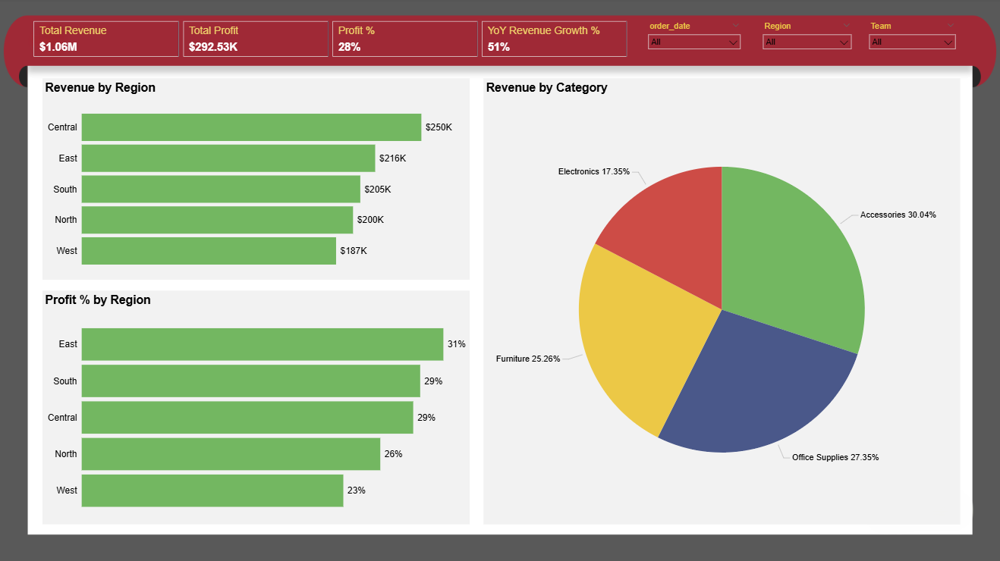
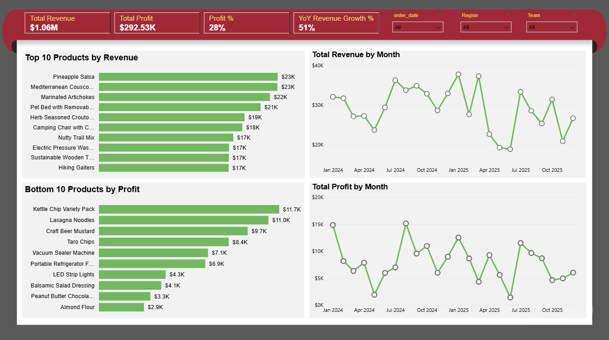
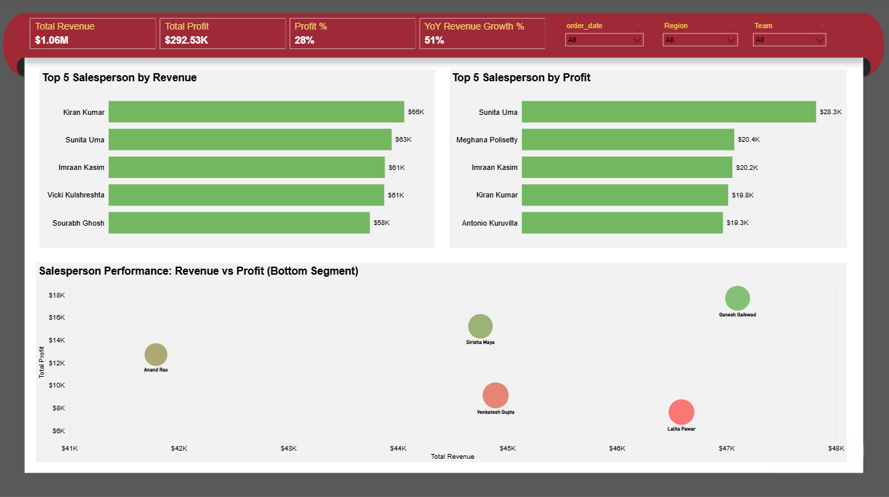
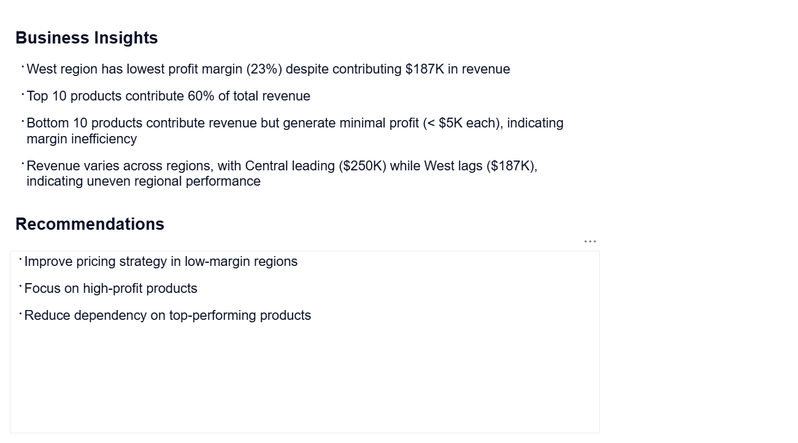

#  Retail Sales Performance Dashboard

##  Overview
This project presents a Power BI dashboard analyzing retail sales performance across regions, products, and sales teams.

---

##  Data Model
- Fact Table: Sales_Fact  
- Dimension Tables:
  - Products  
  - Regions  
  - Salespersons  
  - Date  

A star schema model is used for optimized performance.

---

##  Key Features
- KPI tracking (Revenue, Profit, Profit %, YoY Growth)
- Regional performance analysis
- Product-level insights (Top & Bottom performers)
- Salesperson performance analysis
- Time-based trend analysis using custom Date table

---

##  Dashboard Preview

### 1. Overview

### 2. Product Analysis

### 3. Salesperson Performance

### 4. Business Insights

---

##  Key Insights
- West region has the lowest profit margin despite strong revenue  
- Top 10 products contribute ~60% of total revenue  
- Some products generate revenue but yield low profit  
- Sales performance varies significantly across regions  

---

##  Recommendations
- Improve pricing strategy in low-margin regions  
- Focus on high-profit products  
- Reduce dependency on top-performing products  

---

##  Tools Used
- Power BI  
- Power Query (M Language)  
- DAX  

---

##  Files Included
- `.pbix` file  
- Dashboard PDF  

---

##  About Me
Aspiring Data Analyst with a focus on Power BI, DAX, and business insights.
